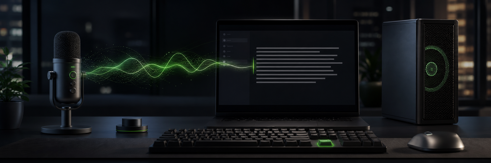

# Push-to-Talk Local Dictation

Hold **Right Ctrl**, speak, release — your words are transcribed locally on the GPU and
pasted into the active window. Zero cloud. English only.

**Windows only. Requires an NVIDIA GPU** (or run on CPU — see "Choosing a model").

## Setup
    py -3.14 -m venv .venv
    .\.venv\Scripts\Activate.ps1
    pip install -r requirements.txt
    python dictate.py        # first run downloads ~1.6 GB model

## Autostart
Uses Task Scheduler (not the Startup folder) so it restarts automatically on crash. Register once:

    $r = "C:\path\to\AI Voice Transcription"
    $action = New-ScheduledTaskAction -Execute "$r\.venv\Scripts\pythonw.exe" -Argument "`"$r\dictate.py`"" -WorkingDirectory $r
    $trigger = New-ScheduledTaskTrigger -AtLogOn -User $env:USERNAME
    $settings = New-ScheduledTaskSettingsSet -RestartInterval (New-TimeSpan -Minutes 1) -RestartCount 10 -ExecutionTimeLimit ([TimeSpan]::Zero) -MultipleInstances IgnoreNew
    Register-ScheduledTask -TaskName "AI Voice Dictation" -Action $action -Trigger $trigger -Settings $settings -RunLevel Limited -Force

To start immediately without rebooting: `Start-ScheduledTask -TaskName "AI Voice Dictation"`

## Choosing a model (GPU load vs. accuracy)

The model loads once and **stays resident in VRAM the whole time the app runs** — and with
autostart (below) that means whenever you're logged in. If you also game, edit video, or run
other GPU-heavy work, pick a lighter model or run on CPU. Set an environment variable before
launching — no code edit needed (VRAM figures are approximate, `int8`):

| `DICTATE_MODEL`            | VRAM     | Notes                              |
|----------------------------|----------|------------------------------------|
| `large-v3-turbo` (default) | ~1.6 GB  | best accuracy                      |
| `distil-large-v3`          | ~1.5 GB  | faster, similar accuracy           |
| `small.en`                 | ~0.7 GB  | lightest GPU option, English       |
| any + `DICTATE_DEVICE=cpu` | **0 GB** | runs on CPU/RAM instead — slower   |

**Just trying one out** for the current terminal session only:

    $env:DICTATE_MODEL = "small.en"; python dictate.py

**Set it permanently** (survives reboots; the autostart task picks it up too). Edit the one
value, then paste the whole block into PowerShell:

```powershell
$model = "small.en"        # large-v3-turbo (default) | distil-large-v3 | small.en
# For no GPU load, also run:  [Environment]::SetEnvironmentVariable("DICTATE_DEVICE","cpu","User")

[Environment]::SetEnvironmentVariable("DICTATE_MODEL", $model, "User")
# If autostart is already running, restart it so the change takes effect now:
if (Get-ScheduledTask -TaskName "AI Voice Dictation" -ErrorAction SilentlyContinue) {
    Stop-ScheduledTask  -TaskName "AI Voice Dictation"
    Start-ScheduledTask -TaskName "AI Voice Dictation"
}
Write-Host "DICTATE_MODEL set to $model."
```

`DICTATE_DEVICE=cpu` auto-uses `int8` compute; override with `DICTATE_COMPUTE` if you need to.

**Free the VRAM for a gaming/rendering session** without uninstalling — stop the background
task (it restarts at next login, or `Start-ScheduledTask` it):

    Stop-ScheduledTask -TaskName "AI Voice Dictation"

## Known limitations
- Won't capture the hotkey while an **elevated/admin** window is focused (Windows UIPI).
- Clipboard restore is **text-only**; a copied image/file is lost during a dictation.
- Text pastes into whatever window has focus **at release** — switching windows mid-speech
  lands the text in the new window.

## Credits
Speech recognition by [faster-whisper](https://github.com/SYSTRAN/faster-whisper) and
[CTranslate2](https://github.com/OpenNMT/CTranslate2) (SYSTRAN), running OpenAI's
[Whisper](https://github.com/openai/whisper) models — all MIT-licensed. Model weights are
downloaded at runtime from Hugging Face; they are not redistributed in this repo.

## License
MIT — see [LICENSE](LICENSE).
